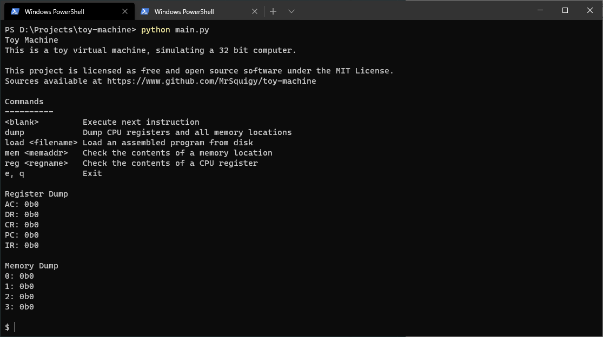

# Toy Machine
This is part of a bigger project, [systoy](https://github.com/MrSquigy/systoy), which is my (in)complete toy system. Right now, it only contains this basic virtual machine and an assembler for it (Get the [tasm assembler](https://github.com/MrSquigy/tasm)).

When running the file, a helpful introductory message will list all available commands. They are not documented here because they will be updated rapidly.

Note: When running programs, make sure the program file is in the same directory as this file (repository root)

